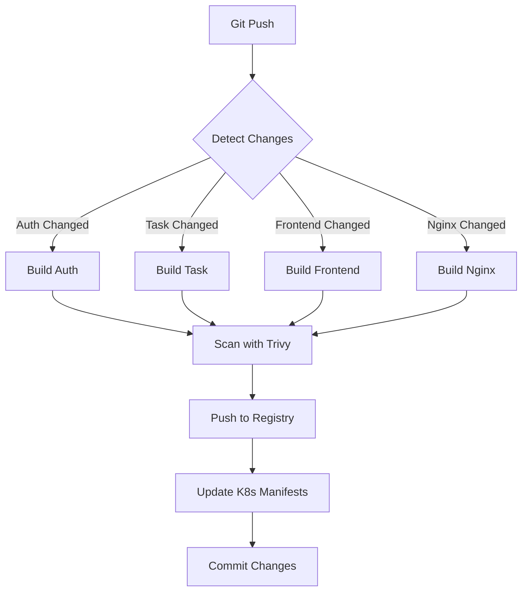

# 🚀 CI/CD Pipeline - Quick Start Guide

## ⚡ 5-Minute Setup

### 1. Choose Your Registry

**Option A: Docker Hub** (Recommended for getting started)
```bash
# Run the setup script
./.github/workflows/setup-pipeline.sh

# Or manually add secrets
gh secret set DOCKER_USERNAME
gh secret set DOCKER_PASSWORD
```

**Option B: AWS ECR** (Production-ready)
```bash
# Run the setup script and choose option 2
./.github/workflows/setup-pipeline.sh

# Or manually
gh secret set AWS_ACCESS_KEY_ID
gh secret set AWS_SECRET_ACCESS_KEY
gh secret set AWS_ACCOUNT_ID
```

### 2. Test the Pipeline
```bash
# Trigger test workflow
gh workflow run test-pipeline.yml

# Watch it run
gh run watch
```

### 3. Trigger Real Build
```bash
# Make a small change
echo "// CI test" >> services/frontend/src/App.jsx

# Commit and push
git add services/frontend/src/App.jsx
git commit -m "test: trigger CI pipeline"
git push
```

## 📊 What Happens When You Push?



## 🎯 Pipeline Stages Explained

| Stage | What Happens | Duration |
|-------|-------------|----------|
| **Detect Changes** | Checks which services modified | ~10s |
| **Build Images** | Builds only changed services | 2-5 min |
| **Security Scan** | Trivy scans for vulnerabilities | 1-2 min |
| **Push to Registry** | Uploads images with tags | 1-2 min |
| **Update K8s** | Modifies deployment YAMLs | ~20s |
| **Total** | Complete pipeline | **3-8 min** |

## 📁 File Structure

```
.github/workflows/
├── ci-cd-pipeline.yml    # Main pipeline (Docker Hub)
├── ci-cd-ecr.yml         # AWS ECR alternative
├── test-pipeline.yml     # Test your setup
├── setup-pipeline.sh     # Setup helper script
└── README.md             # Full documentation
```

## 🔍 Change Detection Examples

### Example 1: Frontend Only
```bash
# Change frontend code
vim services/frontend/src/App.jsx
git commit -am "feat: update UI"
git push
```
**Result**: Only `build-frontend` job runs (~3 min)

### Example 2: Multiple Services
```bash
# Change multiple services
vim services/auth-service/server.js
vim services/frontend/src/App.jsx
git commit -am "feat: update auth and UI"
git push
```
**Result**: `build-auth-service` and `build-frontend` run in parallel (~4 min)

### Example 3: All Services
```bash
# Change common dependency
vim services/docker-compose.yml
git commit -am "chore: update docker-compose"
git push
```
**Result**: All services build if docker-compose affects them

## 🔧 Common Commands

### View Pipeline Status
```bash
# List recent runs
gh run list

# Watch current run
gh run watch

# View specific run
gh run view <run-id> --log
```

### Manage Secrets
```bash
# List secrets
gh secret list

# Add new secret
gh secret set SECRET_NAME

# Delete secret
gh secret delete SECRET_NAME
```

### Trigger Workflows
```bash
# Trigger test workflow
gh workflow run test-pipeline.yml

# Trigger main pipeline manually
gh workflow run ci-cd-pipeline.yml
```

### Debug Issues
```bash
# View failed run logs
gh run list --status failure
gh run view <failed-run-id> --log

# Re-run failed jobs
gh run rerun <run-id>

# Re-run only failed jobs
gh run rerun <run-id> --failed
```

## 🛡️ Security Scanning

### View Scan Results

1. **GitHub UI**: Repository → Security → Code scanning alerts
2. **Workflow logs**: Actions tab → Click on run → View scan step
3. **SARIF files**: Downloadable from workflow artifacts

### Understanding Severity

- 🔴 **CRITICAL**: Immediate action required
- 🟠 **HIGH**: Fix before production
- 🟡 **MEDIUM**: Should fix
- 🔵 **LOW**: Nice to fix
- ⚪ **INFO**: Informational only

### Configure Scan Behavior

**Fail build on vulnerabilities**:
```yaml
exit-code: '1'  # Change from '0' to '1'
```

**Scan more severity levels**:
```yaml
severity: 'CRITICAL,HIGH,MEDIUM'  # Add MEDIUM
```

## 📦 Image Tags Explained

Every successful build creates two tags:

| Tag | Example | Use Case |
|-----|---------|----------|
| **Git SHA** | `abc123def456` | Production deployments (immutable) |
| **latest** | `latest` | Development/testing |

**K8s deployments use Git SHA** for traceability:
```yaml
image: dockerhub/task-manager-auth:abc123def456
```

## 🎨 Customization

### Change Docker Registry
```yaml
# In workflow file
env:
  DOCKER_REGISTRY: myregistry.io
  DOCKER_USERNAME: myorganization
```

### Add New Service
1. **Update change detection**:
```yaml
filters: |
  my-service:
    - 'services/my-service/**'
```

2. **Add build job**: Copy existing job and modify service name

3. **Update K8s update step**: Add deployment file path

### Modify Build Process

**Add tests before build**:
```yaml
- name: Run tests
  run: |
    cd services/auth-service
    npm test
```

**Add linting**:
```yaml
- name: Lint code
  run: |
    npm run lint
    # or
    flake8 app.py
```

## 🚨 Troubleshooting

### Issue: Pipeline doesn't trigger

✅ **Check**:
- Branch name matches workflow trigger (`main` or `develop`)
- Changes in `services/**` directory
- Commit message doesn't have `[skip ci]`

### Issue: Docker login fails

✅ **Docker Hub**:
```bash
# Test locally
docker login -u $DOCKER_USERNAME -p $DOCKER_PASSWORD

# Regenerate token at hub.docker.com
```

✅ **AWS ECR**:
```bash
# Test AWS credentials
aws sts get-caller-identity

# Check ECR permissions
aws ecr describe-repositories
```

### Issue: Image not found in K8s

✅ **Check**:
1. Image was pushed successfully (view workflow logs)
2. K8s manifest has correct image name
3. Image pull secrets configured (if using private registry)

### Issue: K8s manifest not updating

✅ **Check**:
1. Workflow has write permissions
2. Artifacts from build jobs exist
3. sed/yq commands are correct

## 📚 Resources

### Documentation
- [Full README](./.github/workflows/README.md) - Complete documentation
- [Docker Hub](https://hub.docker.com/) - Container registry
- [AWS ECR Docs](https://docs.aws.amazon.com/ecr/) - AWS container registry
- [Trivy](https://github.com/aquasecurity/trivy) - Security scanner

### GitHub Actions
- [Workflow syntax](https://docs.github.com/en/actions/reference/workflow-syntax-for-github-actions)
- [Secrets](https://docs.github.com/en/actions/security-guides/encrypted-secrets)
- [Expressions](https://docs.github.com/en/actions/learn-github-actions/expressions)

## ✅ Checklist

- [ ] GitHub CLI installed and authenticated
- [ ] Secrets configured (DOCKER_USERNAME, DOCKER_PASSWORD or AWS keys)
- [ ] Test workflow runs successfully
- [ ] Made test commit to trigger pipeline
- [ ] Verified images pushed to registry
- [ ] Checked K8s manifests updated
- [ ] Reviewed security scan results
- [ ] Pipeline runs on every push to main/develop

## 🎉 Success Indicators

Your pipeline is working correctly when:

1. ✅ Status badge shows passing in README
2. ✅ Images appear in Docker Hub/ECR with correct tags
3. ✅ K8s manifests updated automatically
4. ✅ Security scans complete without critical issues
5. ✅ Pipeline completes in < 10 minutes
6. ✅ Only changed services build (saves time)

---

**Need Help?** Check [README.md](./README.md) for detailed documentation

**Quick Start**: Run `./.github/workflows/setup-pipeline.sh` to configure everything!
