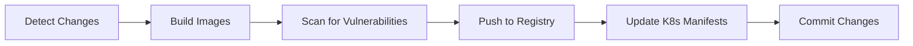

# CI/CD Pipeline Documentation

## Overview

This repository includes intelligent CI/CD pipelines that automatically detect service changes, build only affected services, scan for vulnerabilities, and update Kubernetes manifests.

## 🚀 Pipeline Features

### 1. **Smart Change Detection**
- Automatically detects which services changed using path filters
- Builds only the modified services (saves time and resources)
- Supports: `auth-service`, `task-service`, `frontend`, `nginx`

### 2. **Multi-Stage Build Process**


### 3. **Security Scanning**
- **Trivy**: Scans for CVEs, misconfigurations, and secrets
- **Results uploaded to GitHub Security tab**
- Optional Snyk integration

### 4. **Automated Image Tagging**
- Uses Git commit SHA as image tag
- Also tags as `latest`
- Updates K8s manifests automatically

## 📋 Available Workflows

### 1. `ci-cd-pipeline.yml` - Docker Hub
**Use when**: Pushing to Docker Hub or generic Docker registry

**Triggers**:
- Push to `main` or `develop` branches
- Pull requests to `main` or `develop`
- Only when `services/**` changes

**Jobs**:
1. `detect-changes` - Identifies modified services
2. `build-auth-service` - Builds auth service if changed
3. `build-task-service` - Builds task service if changed
4. `build-frontend` - Builds frontend if changed
5. `build-nginx` - Builds nginx if changed
6. `update-k8s-manifests` - Updates deployment YAMLs
7. `pipeline-summary` - Creates summary report

### 2. `ci-cd-ecr.yml` - AWS ECR
**Use when**: Using AWS infrastructure

**Features**:
- Automatic ECR repository creation
- Matrix strategy for parallel builds
- Built-in image scanning on push
- Optimized for AWS EKS deployments

## 🔧 Setup Instructions

### Prerequisites

1. **GitHub Repository Secrets** (Settings → Secrets → Actions)

#### For Docker Hub (`ci-cd-pipeline.yml`):
```bash
DOCKER_USERNAME=your-dockerhub-username
DOCKER_PASSWORD=your-dockerhub-password-or-token
```

#### For AWS ECR (`ci-cd-ecr.yml`):
```bash
AWS_ACCESS_KEY_ID=your-aws-access-key
AWS_SECRET_ACCESS_KEY=your-aws-secret-key
AWS_ACCOUNT_ID=123456789012
```

#### Optional:
```bash
SNYK_TOKEN=your-snyk-token  # For Snyk scanning
```

### Step 1: Choose Your Workflow

#### Option A: Docker Hub (Simpler)
1. Keep `ci-cd-pipeline.yml` active
2. Delete or rename `ci-cd-ecr.yml` to disable it
3. Update `DOCKER_USERNAME` in the workflow if needed

#### Option B: AWS ECR (Production-Ready)
1. Keep `ci-cd-ecr.yml` active
2. Delete or rename `ci-cd-pipeline.yml`
3. Update `AWS_REGION` in the workflow
4. Ensure ECR repositories exist or will be auto-created

### Step 2: Add GitHub Secrets

```bash
# For Docker Hub
gh secret set DOCKER_USERNAME
gh secret set DOCKER_PASSWORD

# For AWS ECR
gh secret set AWS_ACCESS_KEY_ID
gh secret set AWS_SECRET_ACCESS_KEY
gh secret set AWS_ACCOUNT_ID
```

### Step 3: Configure AWS ECR (If using)

```bash
# Create ECR repositories (or pipeline will auto-create)
aws ecr create-repository --repository-name task-manager-auth \
    --image-scanning-configuration scanOnPush=true \
    --encryption-configuration encryptionType=AES256

aws ecr create-repository --repository-name task-manager-task
aws ecr create-repository --repository-name task-manager-frontend
aws ecr create-repository --repository-name task-manager-nginx
```

### Step 4: Test the Pipeline

```bash
# Make a change to a service
echo "// test change" >> services/auth-service/server.js

# Commit and push
git add services/auth-service/server.js
git commit -m "test: trigger CI pipeline"
git push origin main
```

## 📊 Understanding the Pipeline Flow

### Change Detection Logic

The pipeline uses `dorny/paths-filter@v3` to detect changes:

```yaml
filters: |
  auth-service:
    - 'services/auth-service/**'
  task-service:
    - 'services/task-service/**'
  frontend:
    - 'services/frontend/**'
  nginx:
    - 'services/nginx/**'
```

**Example**: If you modify `services/frontend/src/App.jsx`:
- ✅ Frontend job runs
- ⏭️ Auth, Task, Nginx jobs skipped
- ⏱️ Pipeline completes in ~3-5 minutes instead of 15+

### Build Process

Each service build includes:

1. **Checkout**: Get latest code
2. **Setup Buildx**: Docker multi-platform support
3. **Login**: Authenticate to registry
4. **Build**: Create Docker image with caching
5. **Scan**: Run Trivy security scan
6. **Push**: Upload to registry with tags
7. **Artifact**: Save metadata for K8s update

### Image Tagging Strategy

```
Repository: dockerhub/task-manager-auth
Tags:
  - abc123def456  (Git SHA - unique per commit)
  - latest        (Always points to latest build)
```

### K8s Manifest Updates

The pipeline automatically updates:
- `k8s/base/users-deployment.yaml` → Auth service image
- `k8s/base/logout-deployment.yaml` → Task service image
- `k8s/base/frontend-deployment.yaml` → Frontend image

**Example commit message**:
```
chore: update K8s manifests with new image tags [skip ci]

- Auth Service: abc123def456
- Task Service: no change
- Frontend: abc123def456
- Nginx: no change

Updated by GitHub Actions
```

## 🔐 Security Scanning

### Trivy Scanning

**What it checks**:
- OS vulnerabilities (CVEs)
- Application dependencies
- Misconfigurations
- Exposed secrets

**Results location**:
- GitHub Security tab → Code scanning alerts
- Workflow logs

**Severity levels**:
- 🔴 CRITICAL - Must fix immediately
- 🟠 HIGH - Fix before production
- 🟡 MEDIUM - Fix when possible
- 🟢 LOW - Nice to fix

**Configuration**:
```yaml
severity: 'CRITICAL,HIGH'  # Scan for critical and high only
exit-code: '0'              # Don't fail build (change to 1 to fail)
```

### Optional: Snyk Integration

Uncomment in workflow:
```yaml
- name: Scan with Snyk
  if: matrix.changed == 'true'
  uses: snyk/actions/docker@master
  env:
    SNYK_TOKEN: ${{ secrets.SNYK_TOKEN }}
```

## 📈 Performance Optimizations

### 1. Build Caching
```yaml
cache-from: type=gha
cache-to: type=gha,mode=max
```
- Uses GitHub Actions cache
- Speeds up rebuilds by ~60%

### 2. Parallel Builds
```yaml
strategy:
  matrix:
    include:
      - service: auth-service
      - service: task-service
```
- All changed services build simultaneously
- Total pipeline time = slowest service build time

### 3. Conditional Execution
```yaml
if: needs.detect-changes.outputs.auth-service == 'true'
```
- Jobs skip if service unchanged
- Saves minutes and GitHub Actions quota

## 🐛 Troubleshooting

### Problem: Pipeline doesn't trigger

**Solution**:
```yaml
# Check workflow triggers match your branch
on:
  push:
    branches: [main, develop]  # Add your branch here
```

### Problem: Docker login fails

**For Docker Hub**:
```bash
# Test credentials locally
echo $DOCKER_PASSWORD | docker login -u $DOCKER_USERNAME --password-stdin

# Regenerate Docker Hub token
# Go to Docker Hub → Account Settings → Security → New Access Token
```

**For AWS ECR**:
```bash
# Test AWS credentials
aws ecr get-login-password --region us-east-1

# Check IAM permissions (needs ECR full access)
aws iam get-user
```

### Problem: K8s manifest update fails

**Check**:
1. Repository has write permissions
2. Workflow uses correct token:
   ```yaml
   token: ${{ secrets.GITHUB_TOKEN }}
   ```
3. Commit message includes `[skip ci]` to prevent loop

### Problem: Build fails for specific service

**Debug steps**:
```bash
# Test build locally
cd services/auth-service
docker build -t test .

# Check Dockerfile syntax
docker build --check .

# View detailed logs in GitHub Actions
```

## 📊 Monitoring & Insights

### GitHub Actions Dashboard
- **Actions tab** → View all workflow runs
- **Insights** → See success rate, duration trends
- **Security** → View Trivy scan results

### Useful Metrics
- **Build time per service**
- **Cache hit rate**
- **Vulnerability count over time**
- **Failed builds by service**

## 🔄 Updating the Pipeline

### Add a new service

1. **Update change detection**:
```yaml
filters: |
  new-service:
    - 'services/new-service/**'
```

2. **Add build job**:
```yaml
build-new-service:
  needs: detect-changes
  if: needs.detect-changes.outputs.new-service == 'true'
  # ... copy from existing service
```

3. **Update K8s manifest job**:
```yaml
update_deployment "new" "k8s/base/new-deployment.yaml"
```

### Customize for your environment

**Change registry**:
```yaml
env:
  DOCKER_REGISTRY: myregistry.io
  DOCKER_USERNAME: myorg
```

**Change AWS region**:
```yaml
env:
  AWS_REGION: eu-west-1
```

**Adjust scan severity**:
```yaml
severity: 'CRITICAL,HIGH,MEDIUM'  # More strict
exit-code: '1'                     # Fail on findings
```

## 📚 Best Practices

### 1. Branch Strategy
```
main (production)
  ↑
develop (staging)
  ↑
feature/* (development)
```

### 2. Commit Messages
```bash
# Trigger pipeline
git commit -m "feat: add new endpoint to auth service"

# Skip pipeline
git commit -m "docs: update README [skip ci]"
```

### 3. Testing Before Merge
- Always create PR to `develop` first
- Pipeline runs on PR to validate changes
- Merge to `main` only after successful build

### 4. Image Tag Strategy
- **Git SHA**: Immutable, traceable to specific commit
- **latest**: Always use in development
- **Production**: Pin to specific SHA tags

## 🎯 Next Steps

1. ✅ Set up GitHub secrets
2. ✅ Choose and configure workflow (Docker Hub or ECR)
3. ✅ Test with a small change
4. ✅ Monitor first pipeline run
5. ✅ Review security scan results
6. ✅ Configure Kubernetes to use new images

## 📞 Support

**Common Commands**:
```bash
# View workflow logs
gh run list
gh run view <run-id> --log

# Trigger workflow manually
gh workflow run ci-cd-pipeline.yml

# List secrets
gh secret list

# Delete old workflow runs
gh run list --limit 100 | awk '{print $7}' | xargs -I {} gh run delete {}
```

---

**Pipeline Status**: [](../../actions/workflows/ci-cd-pipeline.yml)

**Last Updated**: January 9, 2026
