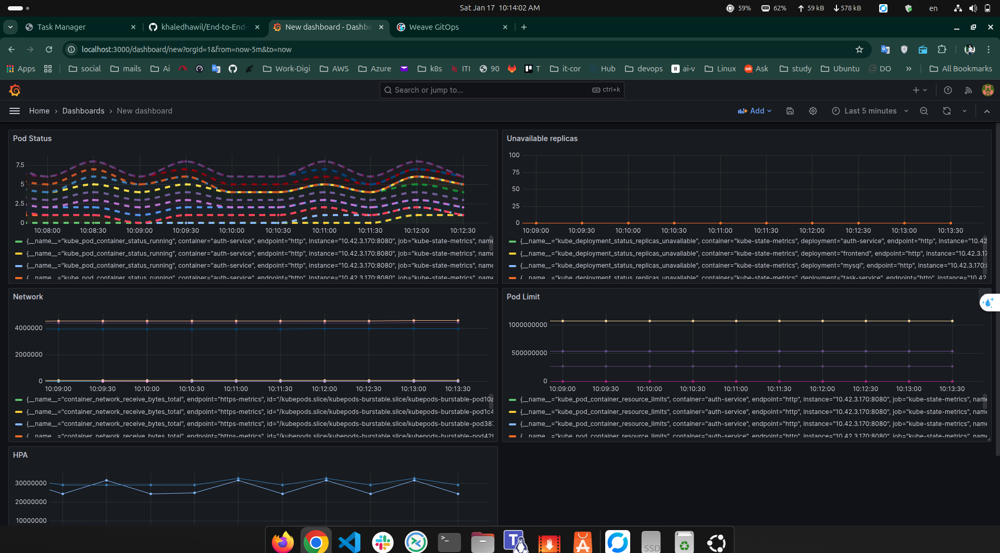

# Task Management System - Complete DevOps Pipeline

A production-ready microservices application demonstrating end-to-end DevOps practices including GitOps, CI/CD automation, container orchestration, monitoring, and security scanning.

---

## Table of Contents

1. [Project Overview](#project-overview)
2. [System Architecture](#system-architecture)
3. [Technology Stack](#technology-stack)
4. [Tools Deep Dive](#tools-deep-dive)
   - [RKE2 Kubernetes](#1-rke2-kubernetes)
   - [Flux CD GitOps](#2-flux-cd-gitops)
   - [Weave GitOps Dashboard](#3-weave-gitops-dashboard)
   - [GitHub Actions CI/CD](#4-github-actions-cicd)
   - [Prometheus Monitoring](#5-prometheus-monitoring)
   - [Grafana Visualization](#6-grafana-visualization)
   - [Horizontal Pod Autoscaler](#7-horizontal-pod-autoscaler-hpa)
   - [Trivy Security Scanner](#8-trivy-security-scanner)
   - [Kustomize Configuration](#9-kustomize-configuration)
5. [Prerequisites](#prerequisites)
6. [Complete Deployment Guide](#complete-deployment-guide)
7. [Accessing the Applications](#accessing-the-applications)
8. [Monitoring and Observability](#monitoring-and-observability)
9. [Repository Structure](#repository-structure)
10. [Screenshots](#screenshots)
11. [Troubleshooting Guide](#troubleshooting-guide)

---

## Project Overview

This project implements a complete cloud-native task management application with a full DevOps pipeline. The system consists of:

**Application Services:**
- **Frontend**: React 18 single-page application with Vite build tool
- **Auth Service**: Node.js/Express REST API for user authentication (JWT-based)
- **Task Service**: Python/Flask REST API for task CRUD operations
- **Database**: MySQL 8.0 for persistent storage

**DevOps Components:**
- **GitOps**: Flux CD for continuous delivery from Git
- **CI/CD**: GitHub Actions for automated builds and security scanning
- **Monitoring**: Prometheus + Grafana stack for observability
- **Autoscaling**: HPA for dynamic pod scaling
- **Security**: Trivy vulnerability scanning, Network Policies, RBAC

---

## System Architecture

```
                                 +------------------+
                                 |    Developer     |
                                 +--------+---------+
                                          |
                                    git push
                                          |
                                          v
                    +---------------------+----------------------+
                    |                                            |
                    v                                            v
         +------------------+                         +-------------------+
         |  GitHub Actions  |                         |    Flux CD        |
         |  (CI Pipeline)   |                         |  (GitOps Engine)  |
         +--------+---------+                         +---------+---------+
                  |                                             |
      +-----------+-----------+                                 |
      |           |           |                                 |
      v           v           v                                 |
   Build      Trivy       Push to                               |
   Images     Scan       Docker Hub                             |
      |           |           |                                 |
      +-----------+-----------+                                 |
                  |                                             |
                  v                                             v
         +----------------+                          +-------------------+
         |  Docker Hub    |                          | K8s Manifests     |
         | (Registry)     |                          | (Git Repository)  |
         +-------+--------+                          +---------+---------+
                 |                                             |
                 |            +------------------------+       |
                 +----------->|  RKE2 Kubernetes       |<------+
                              |  Cluster               |
                              +------------------------+
                                         |
            +----------------------------+----------------------------+
            |                            |                            |
            v                            v                            v
   +----------------+          +------------------+          +----------------+
   |  tms-app       |          |  monitoring      |          |  flux-system   |
   |  namespace     |          |  namespace       |          |  namespace     |
   +----------------+          +------------------+          +----------------+
   | - Frontend     |          | - Prometheus     |          | - Source Ctrl  |
   | - Auth Service |          | - Grafana        |          | - Kustomize    |
   | - Task Service |          | - Alertmanager   |          | - Helm Ctrl    |
   | - MySQL        |          | - Node Exporter  |          | - Weave GitOps |
   | - Ingress      |          | - Kube State     |          +----------------+
   +----------------+          +------------------+
            |                            |
            v                            v
   +----------------+          +------------------+
   |  HPA           |          |  ServiceMonitors |
   |  (Autoscaling) |          |  (Metrics)       |
   +----------------+          +------------------+
```

**Data Flow:**

```
User Request --> Nginx Ingress --> Frontend (React)
                                       |
                      +----------------+----------------+
                      |                                 |
                      v                                 v
               Auth Service                      Task Service
               (Node.js)                         (Python)
                      |                                 |
                      +----------------+----------------+
                                       |
                                       v
                                    MySQL
                                  (Database)
```

---

## Technology Stack

| Category | Technology | Version | Purpose |
|----------|------------|---------|---------|
| **Orchestration** | RKE2 | v1.28+ | Production Kubernetes distribution |
| **GitOps** | Flux CD | v2.0+ | Continuous delivery from Git |
| **GitOps UI** | Weave GitOps | v0.38+ | Visual Flux management |
| **CI/CD** | GitHub Actions | - | Build, test, deploy automation |
| **Monitoring** | Prometheus | v2.48+ | Metrics collection and alerting |
| **Visualization** | Grafana | v10.2+ | Dashboards and analytics |
| **Security** | Trivy | v0.48+ | Container vulnerability scanning |
| **Registry** | Docker Hub | - | Container image storage |
| **Config** | Kustomize | v5.0+ | Kubernetes manifest management |
| **Ingress** | Nginx | v1.9+ | HTTP routing and load balancing |
| **Frontend** | React + Vite | v18 / v5 | User interface |
| **Auth API** | Node.js + Express | v20 | Authentication service |
| **Task API** | Python + Flask | v3.11 | Task management service |
| **Database** | MySQL | v8.0 | Data persistence |

---

## Tools Deep Dive

### 1. RKE2 Kubernetes

**What is RKE2?**
RKE2 (Rancher Kubernetes Engine 2) is a fully conformant Kubernetes distribution focused on security and compliance. It's designed for production environments requiring high security standards.

**Key Features:**
- CIS Kubernetes Benchmark compliant out of the box
- Uses containerd as the container runtime (not Docker)
- Embedded etcd for cluster state storage
- Automatic certificate rotation
- Hardened security defaults

**How to Use:**

```bash
# Install RKE2 on control plane node
curl -sfL https://get.rke2.io | sh -
systemctl enable rke2-server.service
systemctl start rke2-server.service

# Get node token for workers
cat /var/lib/rancher/rke2/server/node-token

# Configure kubectl
export KUBECONFIG=/etc/rancher/rke2/rke2.yaml
kubectl get nodes

# Check cluster health
kubectl get componentstatuses
kubectl cluster-info
```

**Verify Installation:**
```bash
# All nodes should be Ready
kubectl get nodes -o wide
NAME          STATUS   ROLES                       AGE   VERSION
master        Ready    control-plane,etcd,master   1d    v1.28.x+rke2r1
worker-1      Ready    <none>                      1d    v1.28.x+rke2r1
worker-2      Ready    <none>                      1d    v1.28.x+rke2r1
```

---

### 2. Flux CD GitOps

**What is Flux CD?**
Flux is a GitOps operator that continuously monitors your Git repository and automatically applies changes to your Kubernetes cluster. It ensures your cluster state always matches what's defined in Git.

**Core Components:**
- **Source Controller**: Watches Git repositories for changes
- **Kustomize Controller**: Applies Kustomize configurations
- **Helm Controller**: Manages Helm releases
- **Notification Controller**: Sends alerts on events

**How to Use:**

```bash
# Install Flux CLI
curl -s https://fluxcd.io/install.sh | sudo bash

# Verify CLI installation
flux --version

# Install Flux components in cluster
flux install

# Verify Flux is running
flux check
kubectl get pods -n flux-system

# Create GitRepository source
kubectl apply -f flux/clusters/local/git-repository.yaml

# Create Kustomization to deploy app
kubectl apply -f flux/clusters/local/kustomization-app.yaml

# Check synchronization status
flux get sources git
flux get kustomizations

# Force reconciliation
flux reconcile source git task-management-system
flux reconcile kustomization task-management-system-local

# View Flux logs
flux logs --follow
```

**GitRepository Configuration:**
```yaml
apiVersion: source.toolkit.fluxcd.io/v1
kind: GitRepository
metadata:
  name: task-management-system
  namespace: flux-system
spec:
  interval: 30s              # Check for changes every 30 seconds
  ref:
    branch: master           # Monitor master branch
  url: https://github.com/your-repo.git
```

**Kustomization Configuration:**
```yaml
apiVersion: kustomize.toolkit.fluxcd.io/v1
kind: Kustomization
metadata:
  name: task-management-system-local
  namespace: flux-system
spec:
  interval: 1m0s             # Reconcile every minute
  path: ./k8s/overlays/local # Path to Kustomize overlay
  prune: true                # Remove deleted resources
  sourceRef:
    kind: GitRepository
    name: task-management-system
  healthChecks:              # Wait for deployments to be healthy
    - apiVersion: apps/v1
      kind: Deployment
      name: frontend
      namespace: tms-app
```

---

### 3. Weave GitOps Dashboard

**What is Weave GitOps?**
Weave GitOps provides a graphical user interface for managing Flux CD. It allows you to visualize your GitOps pipelines, monitor synchronization status, and troubleshoot issues.

**How to Install:**

```bash
# Create HelmRepository for Weave GitOps
kubectl apply -f - <<EOF
apiVersion: source.toolkit.fluxcd.io/v1beta2
kind: HelmRepository
metadata:
  name: ww-gitops
  namespace: flux-system
spec:
  interval: 1h
  url: https://helm.gitops.weave.works
EOF

# Create admin password secret
PASSWORD="admin123"
HASHED=$(htpasswd -nbB admin "$PASSWORD" | cut -d: -f2)
kubectl create secret generic cluster-user-auth \
  --namespace flux-system \
  --from-literal=username=admin \
  --from-literal=password="$HASHED"

# Create HelmRelease for Weave GitOps
kubectl apply -f - <<EOF
apiVersion: helm.toolkit.fluxcd.io/v2
kind: HelmRelease
metadata:
  name: ww-gitops
  namespace: flux-system
spec:
  interval: 1h
  chart:
    spec:
      chart: weave-gitops
      sourceRef:
        kind: HelmRepository
        name: ww-gitops
  values:
    adminUser:
      create: true
      createClusterRole: true
      createSecret: false
      username: admin
EOF

# Access the dashboard
kubectl port-forward svc/ww-gitops-weave-gitops -n flux-system 9001:9001
```

**Access URL:** http://localhost:9001
**Credentials:** admin / admin123

**Dashboard Features:**
- View all GitRepositories, Kustomizations, and HelmReleases
- See real-time synchronization status
- Inspect resource details and events
- Navigate between related resources
- View reconciliation history

---

### 4. GitHub Actions CI/CD

**What is GitHub Actions?**
GitHub Actions is a CI/CD platform integrated directly into GitHub. It automates your build, test, and deployment workflows triggered by repository events.

**Pipeline Stages:**
1. **Change Detection**: Identify which services changed
2. **Build**: Create Docker images for modified services
3. **Security Scan**: Run Trivy vulnerability scanning
4. **Push**: Upload images to Docker Hub
5. **Update Manifests**: Update image tags in K8s manifests
6. **Notify**: Send alerts for vulnerabilities

**How to Configure:**

1. **Set up GitHub Secrets:**
   - Go to Repository Settings > Secrets and variables > Actions
   - Add required secrets:

| Secret | Description |
|--------|-------------|
| `DOCKER_USERNAME` | Docker Hub username |
| `DOCKER_PASSWORD` | Docker Hub access token |
| `SLACK_WEBHOOK_URL` | Slack webhook for notifications |

2. **Trigger the Pipeline:**
   - Push changes to `services/` directory
   - Or manually trigger from Actions tab

**Pipeline Configuration (`.github/workflows/ci-cd-pipeline.yml`):**
```yaml
name: CI/CD Pipeline

on:
  push:
    branches: [master]
    paths:
      - 'services/**'
  workflow_dispatch:

jobs:
  detect-changes:
    runs-on: ubuntu-latest
    outputs:
      frontend: ${{ steps.changes.outputs.frontend }}
      auth: ${{ steps.changes.outputs.auth }}
      task: ${{ steps.changes.outputs.task }}
    steps:
      - uses: actions/checkout@v4
      - uses: dorny/paths-filter@v2
        id: changes
        with:
          filters: |
            frontend:
              - 'services/frontend/**'
            auth:
              - 'services/auth-service/**'
            task:
              - 'services/task-service/**'

  build-and-push:
    needs: detect-changes
    runs-on: ubuntu-latest
    steps:
      - uses: actions/checkout@v4
      
      - name: Build Frontend
        if: needs.detect-changes.outputs.frontend == 'true'
        run: |
          docker build -t ${{ secrets.DOCKER_USERNAME }}/task-manager-frontend:${{ github.sha }} ./services/frontend
          
      - name: Trivy Scan
        uses: aquasecurity/trivy-action@master
        with:
          image-ref: '${{ secrets.DOCKER_USERNAME }}/task-manager-frontend:${{ github.sha }}'
          severity: 'CRITICAL,HIGH'
          
      - name: Push to Docker Hub
        run: |
          echo ${{ secrets.DOCKER_PASSWORD }} | docker login -u ${{ secrets.DOCKER_USERNAME }} --password-stdin
          docker push ${{ secrets.DOCKER_USERNAME }}/task-manager-frontend:${{ github.sha }}
```

---

### 5. Prometheus Monitoring

**What is Prometheus?**
Prometheus is an open-source monitoring and alerting toolkit. It collects metrics from configured targets, stores them in a time-series database, and provides a powerful query language (PromQL) for analysis.

**Components Deployed:**
- **Prometheus Server**: Scrapes and stores metrics
- **Alertmanager**: Handles alerts and notifications
- **Node Exporter**: Collects host-level metrics
- **Kube State Metrics**: Exposes Kubernetes object metrics

**How to Install:**

```bash
# Create monitoring namespace
kubectl create namespace monitoring

# Apply HelmRepository
kubectl apply -f - <<EOF
apiVersion: source.toolkit.fluxcd.io/v1beta2
kind: HelmRepository
metadata:
  name: prometheus-community
  namespace: monitoring
spec:
  interval: 1h
  url: https://prometheus-community.github.io/helm-charts
EOF

# Apply HelmRelease (kube-prometheus-stack)
kubectl apply -f k8s/base/monitoring-helmrelease.yaml

# Check installation
kubectl get pods -n monitoring

# Access Prometheus UI
kubectl port-forward -n monitoring svc/kube-prometheus-stack-prometheus 9090:9090
```

**Access URL:** http://localhost:9090

**Useful PromQL Queries:**
```promql
# CPU usage by pod
rate(container_cpu_usage_seconds_total{namespace="tms-app"}[5m])

# Memory usage by pod
container_memory_usage_bytes{namespace="tms-app"}

# Pod restart count
kube_pod_container_status_restarts_total{namespace="tms-app"}

# Running pods count
count(kube_pod_status_phase{namespace="tms-app",phase="Running"})

# HTTP request rate (if metrics exposed)
rate(http_requests_total{namespace="tms-app"}[5m])
```

---

### 6. Grafana Visualization

**What is Grafana?**
Grafana is an open-source analytics and visualization platform. It connects to data sources like Prometheus and provides rich dashboards for monitoring your infrastructure and applications.

**How to Access:**

```bash
# Port-forward Grafana service
kubectl port-forward -n monitoring svc/kube-prometheus-stack-grafana 3000:80
```

**Access URL:** http://localhost:3000
**Credentials:** admin / admin123

**Pre-configured Dashboards:**
1. **Kubernetes Cluster Monitoring** (ID: 7249) - Cluster overview
2. **Kubernetes Pods Monitoring** (ID: 6417) - Pod-level metrics
3. **Node Exporter Full** (ID: 1860) - Host metrics
4. **Task Management System** - Custom application dashboard

**How to Import Additional Dashboards:**
1. Click **+** icon in sidebar
2. Select **Import**
3. Enter Dashboard ID (e.g., 7249)
4. Select Prometheus as data source
5. Click **Import**

**Custom Dashboard Panels:**
- Pod count per service (Frontend, Auth, Task)
- CPU usage graph
- Memory usage graph
- Network traffic
- Pod restarts
- HPA replica counts

---

### 7. Horizontal Pod Autoscaler (HPA)

**What is HPA?**
HPA automatically scales the number of pod replicas based on observed CPU utilization, memory usage, or custom metrics. It ensures your application can handle varying loads efficiently.

**Configuration Applied:**
| Service | Min Replicas | Max Replicas | CPU Target | Memory Target |
|---------|--------------|--------------|------------|---------------|
| Frontend | 1 | 5 | 70% | 80% |
| Auth Service | 2 | 10 | 70% | 80% |
| Task Service | 2 | 10 | 70% | 80% |

**How to View HPA Status:**

```bash
# List all HPAs
kubectl get hpa -n tms-app

# Detailed HPA information
kubectl describe hpa frontend-hpa -n tms-app

# Watch HPA in real-time
kubectl get hpa -n tms-app -w
```

**Expected Output:**
```
NAME               REFERENCE                 TARGETS           MINPODS   MAXPODS   REPLICAS
frontend-hpa       Deployment/frontend       15%/70%, 30%/80%  1         5         1
auth-service-hpa   Deployment/auth-service   25%/70%, 45%/80%  2         10        2
task-service-hpa   Deployment/task-service   20%/70%, 40%/80%  2         10        2
```

**HPA Configuration (`k8s/base/hpa.yaml`):**
```yaml
apiVersion: autoscaling/v2
kind: HorizontalPodAutoscaler
metadata:
  name: auth-service-hpa
  namespace: tms-app
spec:
  scaleTargetRef:
    apiVersion: apps/v1
    kind: Deployment
    name: auth-service
  minReplicas: 2
  maxReplicas: 10
  metrics:
    - type: Resource
      resource:
        name: cpu
        target:
          type: Utilization
          averageUtilization: 70
    - type: Resource
      resource:
        name: memory
        target:
          type: Utilization
          averageUtilization: 80
  behavior:
    scaleDown:
      stabilizationWindowSeconds: 300  # Wait 5 min before scaling down
    scaleUp:
      stabilizationWindowSeconds: 0    # Scale up immediately
```

---

### 8. Trivy Security Scanner

**What is Trivy?**
Trivy is a comprehensive security scanner that detects vulnerabilities in container images, file systems, Git repositories, and Kubernetes configurations.

**Scan Types:**
- **OS Packages**: Alpine, Debian, Ubuntu vulnerabilities
- **Application Dependencies**: npm, pip, go modules
- **IaC Misconfigurations**: Kubernetes, Terraform, CloudFormation
- **Secrets**: API keys, passwords, tokens

**How to Use Locally:**

```bash
# Install Trivy
sudo apt-get install trivy

# Scan a Docker image
trivy image khaledhawil/task-manager-frontend:latest

# Scan with severity filter
trivy image --severity CRITICAL,HIGH khaledhawil/task-manager-auth:latest

# Scan Kubernetes manifests
trivy config ./k8s/

# JSON output for CI/CD
trivy image --format json --output results.json myimage:tag
```

**CI/CD Integration:**
```yaml
- name: Trivy Vulnerability Scan
  uses: aquasecurity/trivy-action@master
  with:
    image-ref: 'myimage:tag'
    format: 'table'
    exit-code: '1'              # Fail on vulnerabilities
    severity: 'CRITICAL,HIGH'
    ignore-unfixed: true
```

**Severity Levels:**
| Level | Action |
|-------|--------|
| CRITICAL | Block deployment, immediate fix required |
| HIGH | Block deployment, fix within 7 days |
| MEDIUM | Warning, plan remediation |
| LOW | Informational |

---

### 9. Kustomize Configuration

**What is Kustomize?**
Kustomize is a Kubernetes-native configuration management tool. It allows you to customize application configurations without modifying the original YAML files using overlays.

**Project Structure:**
```
k8s/
├── base/                    # Base configurations
│   ├── kustomization.yaml
│   ├── namespace.yaml
│   ├── frontend-deployment.yaml
│   ├── auth-service-deployment.yaml
│   └── ...
└── overlays/
    ├── local/               # Local environment overlay
    │   ├── kustomization.yaml
    │   ├── ingress.yaml
    │   └── secrets.yaml
    ├── staging/             # Staging overlay
    └── production/          # Production overlay
```

**How to Use:**

```bash
# Preview generated manifests
kubectl kustomize k8s/overlays/local

# Apply with kustomize
kubectl apply -k k8s/overlays/local

# View differences before applying
kubectl diff -k k8s/overlays/local
```

**Base Kustomization (`k8s/base/kustomization.yaml`):**
```yaml
apiVersion: kustomize.config.k8s.io/v1beta1
kind: Kustomization

namespace: tms-app

resources:
  - namespace.yaml
  - rbac.yaml
  - network-policy.yaml
  - pdb.yaml
  - hpa.yaml
  - frontend-deployment.yaml
  - frontend-service.yaml
  - auth-service-deployment.yaml
  - auth-service.yaml
  - task-service-deployment.yaml
  - task-service.yaml
  - mysql-configmap.yaml
```

**Overlay Kustomization (`k8s/overlays/local/kustomization.yaml`):**
```yaml
apiVersion: kustomize.config.k8s.io/v1beta1
kind: Kustomization

resources:
  - ../../base
  - ingress.yaml
  - mysql-deployment.yaml
  - mysql-service.yaml
  - mysql-pvc.yaml
  - secrets.yaml

images:
  - name: khaledhawil/task-manager-frontend
    newTag: "1.0.22"
```

---

## Prerequisites

### Required Software

| Tool | Version | Installation |
|------|---------|--------------|
| kubectl | v1.28+ | `curl -LO "https://dl.k8s.io/release/$(curl -L -s https://dl.k8s.io/release/stable.txt)/bin/linux/amd64/kubectl"` |
| Flux CLI | v2.0+ | `curl -s https://fluxcd.io/install.sh \| sudo bash` |
| Git | v2.30+ | `sudo apt install git` |
| htpasswd | - | `sudo apt install apache2-utils` |

### Required Accounts

- **GitHub**: Repository hosting and Actions
- **Docker Hub**: Container image registry

### System Requirements

| Resource | Minimum | Recommended |
|----------|---------|-------------|
| CPU | 4 cores | 8 cores |
| RAM | 8 GB | 16 GB |
| Disk | 50 GB | 100 GB |
| Nodes | 1 | 3 |

---

## Complete Deployment Guide

### Step 1: Clone Repository

```bash
git clone https://github.com/khaledhawil/End-to-End-DevOps-AWS-Nodejs-Python-MySQL.git
cd End-to-End-DevOps-AWS-Nodejs-Python-MySQL
```

### Step 2: Set Up RKE2 Cluster

Follow the [RKE2 Cluster Setup Guide](RKE2_cluster.md) or:

```bash
# On control plane
curl -sfL https://get.rke2.io | sh -
systemctl enable --now rke2-server.service

# Configure kubectl
mkdir -p ~/.kube
cp /etc/rancher/rke2/rke2.yaml ~/.kube/config
chmod 600 ~/.kube/config

# Verify
kubectl get nodes
```

### Step 3: Install Flux CD

```bash
# Install CLI
curl -s https://fluxcd.io/install.sh | sudo bash

# Install in cluster
flux install

# Verify
flux check
```

### Step 4: Deploy Application via Flux

```bash
# Apply GitRepository
kubectl apply -f flux/clusters/local/git-repository.yaml

# Apply Kustomization
kubectl apply -f flux/clusters/local/kustomization-app.yaml

# Monitor deployment
flux get kustomizations -w
```

### Step 5: Install Weave GitOps Dashboard

```bash
# Create admin credentials
HASHED=$(htpasswd -nbB admin admin123 | cut -d: -f2)
kubectl create secret generic cluster-user-auth \
  --namespace flux-system \
  --from-literal=username=admin \
  --from-literal=password="$HASHED"

# Apply HelmRepository and HelmRelease
kubectl apply -f flux/clusters/local/ww-gitops-helmrepo.yaml
kubectl apply -f flux/clusters/local/ww-gitops-helmrelease.yaml
```

### Step 6: Deploy Monitoring Stack

```bash
# Create namespace
kubectl create namespace monitoring

# Apply Prometheus stack
kubectl apply -f k8s/base/monitoring-helmrelease.yaml

# Wait for pods
kubectl get pods -n monitoring -w
```

### Step 7: Verify Deployment

```bash
# Check all pods
kubectl get pods -A

# Check services
kubectl get svc -n tms-app
kubectl get svc -n monitoring

# Check HPA
kubectl get hpa -n tms-app

# Check Flux status
flux get all
```

---

## Accessing the Applications

### Application URLs

| Application | Access Method | URL |
|-------------|---------------|-----|
| Frontend | Port-forward | `kubectl port-forward svc/frontend-service -n tms-app 8080:80` then http://localhost:8080 |
| Grafana | Port-forward | `kubectl port-forward svc/kube-prometheus-stack-grafana -n monitoring 3000:80` then http://localhost:3000 |
| Prometheus | Port-forward | `kubectl port-forward svc/kube-prometheus-stack-prometheus -n monitoring 9090:9090` then http://localhost:9090 |
| Weave GitOps | Port-forward | `kubectl port-forward svc/ww-gitops-weave-gitops -n flux-system 9001:9001` then http://localhost:9001 |
| Alertmanager | Port-forward | `kubectl port-forward svc/kube-prometheus-stack-alertmanager -n monitoring 9093:9093` then http://localhost:9093 |

### Credentials

| Application | Username | Password |
|-------------|----------|----------|
| Grafana | admin | admin123 |
| Weave GitOps | admin | admin123 |

---

## Monitoring and Observability

### Grafana Dashboards

1. **Task Management System Dashboard**
   - Pod status for all services
   - CPU and memory usage
   - Network traffic
   - Pod restarts
   - HPA metrics

2. **Kubernetes Cluster Dashboard**
   - Node health
   - Resource utilization
   - Cluster capacity

3. **Node Exporter Dashboard**
   - Host CPU, memory, disk
   - Network interfaces
   - System load

### Alerting Rules

Pre-configured alerts:
- Pod crash looping
- High CPU usage (>80%)
- High memory usage (>80%)
- Node not ready
- Deployment replica mismatch

---

## Repository Structure

```
.
├── .github/
│   └── workflows/
│       └── ci-cd-pipeline.yml      # GitHub Actions CI/CD
│
├── flux/
│   └── clusters/
│       ├── local/                  # Local environment
│       │   ├── git-repository.yaml
│       │   └── kustomization-app.yaml
│       ├── staging/
│       └── production/
│
├── k8s/
│   ├── base/                       # Base manifests
│   │   ├── kustomization.yaml
│   │   ├── namespace.yaml
│   │   ├── rbac.yaml
│   │   ├── network-policy.yaml
│   │   ├── pdb.yaml
│   │   ├── hpa.yaml
│   │   ├── grafana-dashboard.yaml
│   │   ├── monitoring-helmrelease.yaml
│   │   ├── frontend-deployment.yaml
│   │   ├── auth-service-deployment.yaml
│   │   ├── task-service-deployment.yaml
│   │   └── ...
│   └── overlays/
│       ├── local/
│       ├── staging/
│       └── production/
│
├── services/
│   ├── frontend/                   # React application
│   ├── auth-service/               # Node.js API
│   └── task-service/               # Python API
│
├── scripts/
│   └── verify-security.sh
│
├── Screenshots/                    # Documentation images
│
└── README.md
```

---

## Screenshots

### Task Management Application

*Main dashboard showing task management interface*

### CI/CD Pipeline

*GitHub Actions workflow with build and scan stages*

### Pipeline Summary

*Overview of all pipeline jobs and status*

### Kubernetes Cluster

*RKE2 cluster nodes and workloads*

### Weave GitOps Dashboard

*Flux resources in Weave GitOps UI*

### Application in Weave GitOps

*Application kustomization status*

### Grafana Monitoring

*Prometheus metrics visualized in Grafana*

### Slack Notifications

*Security scan alerts in Slack*

---

## Troubleshooting Guide

### Flux Issues

**Kustomization not syncing:**
```bash
# Check status
flux get kustomizations

# View events
kubectl describe kustomization task-management-system-local -n flux-system

# Force reconcile
flux reconcile kustomization task-management-system-local --with-source
```

**GitRepository not found:**
```bash
# Check source status
flux get sources git

# Check for errors
kubectl logs -n flux-system deployment/source-controller
```

### Pod Issues

**Pods stuck in Pending:**
```bash
# Check events
kubectl describe pod <pod-name> -n tms-app

# Check node resources
kubectl top nodes

# Check PVC status
kubectl get pvc -n tms-app
```

**Pods in CrashLoopBackOff:**
```bash
# View logs
kubectl logs <pod-name> -n tms-app --previous

# Check resource limits
kubectl describe pod <pod-name> -n tms-app | grep -A5 "Limits"
```

### Database Issues

**Connection refused:**
```bash
# Check MySQL pod
kubectl get pods -n tms-app -l app=mysql

# Check MySQL logs
kubectl logs -n tms-app deployment/mysql

# Test connection
kubectl exec -it deployment/mysql -n tms-app -- mysql -u root -p
```

### Monitoring Issues

**Grafana shows no data:**
```bash
# Check Prometheus is running
kubectl get pods -n monitoring | grep prometheus

# Verify Prometheus targets
# Go to Prometheus UI > Status > Targets

# Check ServiceMonitors
kubectl get servicemonitor -n tms-app
```

**HPA shows unknown metrics:**
```bash
# Check metrics-server
kubectl get pods -n kube-system | grep metrics

# Verify HPA
kubectl describe hpa -n tms-app
```

### Network Issues

**Services not reachable:**
```bash
# Check service endpoints
kubectl get endpoints -n tms-app

# Test internal connectivity
kubectl run test --rm -it --image=busybox -- wget -qO- http://frontend-service.tms-app

# Check network policies
kubectl get networkpolicy -n tms-app
```

---

## License

This project is provided for educational and demonstration purposes.

## Contributing

Contributions are welcome. Please submit pull requests with clear descriptions of changes.

## Author

Khaled Hawil - DevOps Engineer
